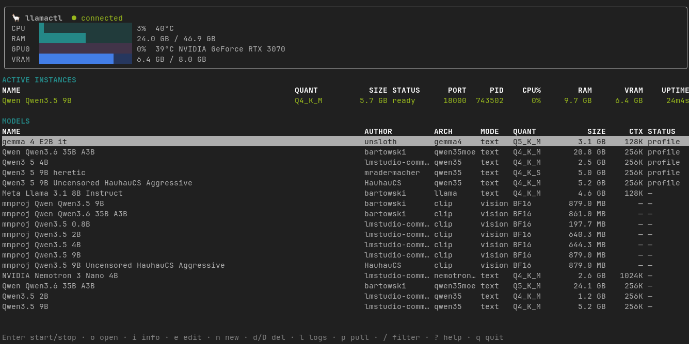

# llamactl

A terminal UI for managing local [`llama-server`](https://github.com/ggml-org/llama.cpp)
(llama.cpp) instances on your machine.

This project is heavily inspired by [`llamastash`](https://github.com/llamastash/llamastash) but i needed some specific stuff, and made my own personal tool, with help from claude. 

**I'd recommend using llamastash rather than this.**

llamactl discovers the GGUF models you already have cached, lets you set and save
`llama-server` flags per model, runs instances in the background via a small daemon
(so the UI doesn't have to stay open), and shows live CPU / RAM / GPU / VRAM usage.



- **TUI** — a full-screen view with live CPU / RAM / GPU / VRAM gauges (and
  temperatures), an **Active instances** list, a **Favorites** shelf, and a
  **Models** catalog, plus an interactive flag editor, a log tail, and
  **Hugging Face search + download**. Start/stop, edit, fetch, and inspect
  without leaving the terminal.
- **Full flag editor** — curated fields for the common `llama-server` flags
  (with presets, enum choosers, and a live VRAM/RAM estimate) **plus a searchable
  "all flags" list generated from your binary's own `llama-server --help`**, so
  every flag the installed build supports is editable and saved per profile.
- **Managed llama.cpp builds** — build and install `llama-server` from source
  (upstream or any repo/ref/PR, CPU or CUDA) and switch the active binary, all
  from the TUI or CLI — no manual cloning or compiling.
- **Daemon (supervisor)** — a long-running background process that owns the child
  `llama-server` processes, a loopback control plane, and the resource sampler.
- **Headless CLI** — every action is also scriptable (`llamactl start`, `ps`,
  `instance add`, `install`, …) with a `--json` contract for automation.

> **Loopback only.** The control plane binds to `127.0.0.1` and is guarded by a
> bearer token rotated on every daemon start. Instances bind to `127.0.0.1` by
> default; binding off-loopback is an explicit per-instance opt-in.

---

## Requirements

- [Bun](https://bun.sh) (developed against 1.3.x)
- A `llama-server` binary — on your `PATH`, pointed to via `--llama-server` /
  `LLAMACTL_LLAMA_SERVER`, or **built from source by llamactl itself**
  (`llamactl install`, or `B` in the TUI). CUDA builds need the CUDA toolkit.
- Optional: `nvidia-smi` for GPU util / VRAM / temperature (NVIDIA). Without it,
  llamactl still shows CPU and RAM and hides the GPU columns.
- CPU temperature is read from Linux `sysfs` (`/sys/class/hwmon`, `/sys/class/thermal`)
  when a CPU sensor is exposed; it's omitted otherwise.

## Install / run

```sh
bun install
bun run src/index.ts          # opens the TUI
```

Or compile a single self-contained executable:

```sh
bun run build                 # produces ./llamactl
./llamactl
```

## The TUI

Run `llamactl` with no arguments. It takes over the terminal (alternate screen,
restored on quit) and shows:

- a **header** with system CPU/RAM gauges (+ CPU temp) and per-GPU util/VRAM
  gauges (+ GPU temp);
- an **ACTIVE INSTANCES** list of running models with live runtime columns
  (status, port, pid, CPU%, RAM, VRAM, uptime);
- a **★ FAVORITES** shelf of models you've starred (`f`), floated to the top;
- a **MODELS** catalog of everything else — grouped by Hugging Face repo — with
  columns read from GGUF metadata: arch, kind (text/vision/embedding), quant,
  size, supported context, and whether a saved profile exists.

A model moves between the two lists as you start/stop it, and the cursor follows it.

| Key | Action |
| --- | --- |
| `j`/`k`, ↓/↑ | Move selection (`g`/`G` jump to top/bottom) |
| `Enter` | Open the launch picker (Default / a saved profile / + New) for the selected model |
| `Ctrl+S` | Stop the selected running instance (confirm) |
| `o` | Open a running instance's web UI in the browser |
| `i` | Show full details about the selected model (path, arch, context, spec, live stats) |
| `e` | Manage the model's profiles — switch / create / **edit flags** / delete |
| `n` | Create a new saved instance profile |
| `f` | Toggle favorite (★) for the selected row |
| `d` | Delete the selected saved profile (confirm with `d`/`y`) |
| `D` | Delete the model file(s) from disk (confirm with `D`/`y`; stop it first) |
| `l` | Tail the running instance's log |
| `p` | Pull a model from Hugging Face (search → browse → download) |
| `P` | Manage downloads (cancel / retry / dismiss) |
| `I` | Manage built llama.cpp installs (select active, log, update, remove) |
| `B` | Build a llama.cpp install from source |
| `/` | Filter the list |
| `?` | Help |
| `q` | Quit (the daemon and instances keep running) |

### The flag editor

`e`/`n` open a form over a `LaunchSpec`. `Tab`/`↑↓` move between fields, text
fields type directly (full cursor: `←/→`, `Ctrl+A`/`Ctrl+E`, edit anywhere), and
choosers use `←/→`:

- **Ctx size** scrolls common presets (2048 → … → 131072) then a **Custom** entry
  you type;
- **Cache K/V** (KV-cache quant), **Flash attn** (auto/on/off), and **Reasoning**
  (auto/on/off) / **Jinja** (default/on/off) are cycled with `←/→`.
- a side panel describes the focused flag, and a live **≈ VRAM / RAM estimate**
  updates as you change context size, GPU layers, and cache types.

Below the curated fields is an **all flags** section: every flag the active
`llama-server` binary accepts, read from its own `llama-server --help`. Type in
the **search** row to filter by name or description; value flags are text inputs
(the `--help` placeholder is shown as a hint) and boolean flags are on/off
switches (`←/→` or space). Anything you set here is saved with the profile and
passed through verbatim — so as llama.cpp adds flags, they show up automatically.
(The list is empty until a `llama-server` binary is available; the section then
tells you why — e.g. no binary, or restart the daemon to pick up a new one.)

`Enter` saves the profile, `Esc` cancels.

## Headless CLI

| Command | What it does |
| --- | --- |
| `llamactl list` | List discovered GGUF models |
| `llamactl start <model> [flags]` | Start a model with ad-hoc flags |
| `llamactl start --instance <id>` | Start a saved profile |
| `llamactl stop <model>` | Stop a running instance |
| `llamactl rm <model> --yes` | Delete a model's file(s) from disk |
| `llamactl ps` | Show running instances (port, pid, uptime, restarts) |
| `llamactl instance ls\|add\|rm\|edit` | Manage saved launch profiles |
| `llamactl search <query>` | Search Hugging Face for GGUF repos |
| `llamactl pull <repo>[:quant]` | Download a model (e.g. `unsloth/Qwen3-0.6B-GGUF:Q4_K_M`) |
| `llamactl downloads [cancel <id>]` | List or cancel downloads |
| `llamactl install [<repo>]` | Build & install llama.cpp from source (no repo ⇒ upstream) |
| `llamactl install ls\|use <id>\|update <id>\|rm <id>\|log <id>` | Manage built installs (set active, refetch+recompile, …) |
| `llamactl daemon start\|stop` | Start/stop the background supervisor |

Launch flags (for `start` and `instance add/edit`):

| Flag | llama-server flag | Notes |
| --- | --- | --- |
| `--ctx <n>` | `--ctx-size` | context size |
| `--ngl <n>` | `--gpu-layers` | GPU layers (default 99 = all) |
| `--threads <n>` | `--threads` | |
| `--batch-size <n>` | `--batch-size` | |
| `--flash-attn` / `--no-flash-attn` | `--flash-attn on\|off` | unset ⇒ auto |
| `--reasoning` / `--no-reasoning` | `--reasoning on\|off` | unset ⇒ auto |
| `--jinja` / `--no-jinja` | `--jinja` / `--no-jinja` | unset ⇒ llama.cpp default |
| `--cache-type-k <t>` / `--cache-type-v <t>` | `--cache-type-k/-v` | f16, q8_0, q4_0, … |
| `--chat-template <t>` | `--chat-template` | built-in name or Jinja string |
| `--host <addr>` | `--host` | default 127.0.0.1 |
| `--port <n>` | `--port` | pin a port (default: auto) |
| `--extra-args "<a b c>"` | (appended verbatim) | escape hatch for any other flag |

Pass `--json` to any command for a single machine-readable document on stdout and
nothing else. Errors are a typed envelope: `{ "error": { "code": "...", "message": "..." } }`.

## Fetching models from Hugging Face

Search and download GGUF models without leaving llamactl. In the TUI press `p`
to search, browse matching repos, pick a quant from the file list, and download;
progress shows in a **Downloads** section and the model appears in the catalog as
soon as it finishes. From the CLI:

```sh
llamactl search qwen3 0.6b                       # find repos
llamactl pull unsloth/Qwen3-0.6B-GGUF:Q4_K_M     # download a specific quant
llamactl downloads                               # watch progress
llamactl downloads cancel <id>                   # cancel one
```

Downloads land in the **standard Hugging Face Hub cache** (`~/.cache/huggingface/hub`,
or `$HF_HOME`/`$HF_HUB_CACHE`), in the same `models--<org>--<name>/{blobs,snapshots,refs}`
layout that `huggingface_hub` and **llama.cpp's `-hf`** use — so a model llamactl
downloads is shared with llama.cpp (it shows up in `llama-server --cache-list`) and a
blob already in the cache is **not re-downloaded**. Sharded models pull all their
shards. **Gated/private repos** work when a token is available: set `hfToken` /
`LLAMACTL_HF_TOKEN`, or just log in once with `huggingface-cli login` (llamactl
reuses `~/.cache/huggingface/token`).

## Managed llama.cpp builds

Don't have a `llama-server` binary, or want a CUDA build without compiling by
hand? llamactl can build and manage llama.cpp installs for you. In the TUI press
`B` to open the build form (repo URL, git ref/branch/PR, CPU or CUDA backend),
and `I` to manage what's built — set the **active** install (the binary the
daemon spawns), tail a build log, refetch + recompile, or remove one. From the
CLI:

```sh
llamactl install                                 # build upstream llama.cpp (CUDA by default)
llamactl install --backend cpu                   # CPU-only build
llamactl install <git-url> --ref pr/1234         # build a fork or a specific PR
llamactl install ls                              # list installs and which is active
llamactl install use <id>                        # make one active
llamactl install update <id>                     # refetch its ref and recompile in place
llamactl install log <id>                        # view the build log
```

The active managed install takes precedence as the spawned binary unless
`llamaServerPath` is set explicitly. Switching the active install re-reads the
new binary's flags for the editor's **all flags** section.

## Configuration

Precedence, lowest to highest:

```
built-in defaults  →  config file  →  environment (LLAMACTL_*)  →  CLI flags
```

The config file is JSON at `$XDG_CONFIG_HOME/llamactl/config.json`
(`~/.config/llamactl/config.json`). Saved instance profiles live alongside it in
`instances.json`. Example config:

```json
{
  "modelPaths": ["/srv/models"],
  "defaultCtx": 8192,
  "llamaServerPath": "/usr/local/bin/llama-server"
}
```

| Setting | Env var | Flag | Default |
| --- | --- | --- | --- |
| Extra model dirs | `LLAMACTL_MODEL_PATHS` (`:`-separated) | `--model-paths a:b` | — |
| Control-plane port | `LLAMACTL_CONTROL_PORT` | `--control-port` | `48134` (scans up) |
| Default context size | `LLAMACTL_CTX` | `--ctx` | `4096` |
| Default GPU layers | `LLAMACTL_GPU_LAYERS` | `--ngl` | `99` (offload all) |
| `llama-server` path | `LLAMACTL_LLAMA_SERVER` | `--llama-server` | from `PATH` |
| Download dir (HF Hub cache) | `LLAMACTL_DOWNLOAD_DIR` | — | `~/.cache/huggingface/hub` (`$HF_HOME`/`$HF_HUB_CACHE`) |
| Hugging Face token | `LLAMACTL_HF_TOKEN` | — | `~/.cache/huggingface/token` |

By default llamactl offloads **all** layers to the GPU (`--gpu-layers 99`). For a
model too large to fit in VRAM, lower it per launch (`--ngl 20`) or in a saved
profile; set `defaultGpuLayers: 0` (or `--ngl 0`) to run on CPU. A CPU-only
`llama-server` build simply ignores the flag.

llamactl scans `~/.cache/huggingface/`, `~/.ollama/models`, and
`~/.lmstudio/models` for `.gguf` files automatically, plus any `modelPaths` you
add. New downloads are picked up live without a restart.

## How it fits together

```
        llamactl TUI ─┐
                      ├─(loopback HTTP + bearer token)─► Control plane ──► Supervisor ──► llama-server child(ren)
        llamactl CLI ─┘                                        ▲
                                                   Resource sampler (/proc + nvidia-smi)
```

- **runtime.json** (mode `0600`, in `$XDG_STATE_HOME/llamactl/`) holds the
  control-plane URL, a fresh bearer token (rotated every start), and the daemon
  PID. The token is never logged.
- The **control plane** (`127.0.0.1:48134`, scanning upward) requires the bearer
  token on every route except `GET /health`, compared in constant time. Routes:
  `/models`, `/ps`, `/stats`, `/llama/flags`, `/instances` (CRUD), `/favorites`,
  `/start`, `/stop`, `/hf/*`, `/pull`, `/downloads`, `/installs`, `/shutdown`.
- The **resource sampler** runs in the daemon, sampling system CPU/RAM (+ CPU
  temp from `sysfs`) from `/proc` and GPU util / VRAM / temp from `nvidia-smi` on
  an interval, joining per-instance usage by PID. The TUI polls `/stats`.
- **Model discovery** reads a small slice of each `.gguf` header to extract the
  architecture, supported context length, and kind (text / vision / embedding).

Per-launch logs land in `$XDG_CACHE_HOME/llamactl/logs/<model-id>-<ts>.log`.

## Development

```sh
bun test                 # run the test suite
bun run typecheck        # tsc --noEmit (strict)
bun run build            # compile ./llamactl
```

Tests cover spec→argv mapping, config merging, model-id resolution, port-scan
fallback, stale-`runtime.json` detection, process supervision (readiness,
crash/restart cap), control-plane auth/routing, the instance store, and the
resource-sampler math — using a tiny fake `llama-server` so no real model is
needed.
